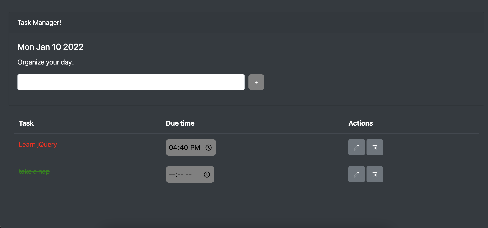
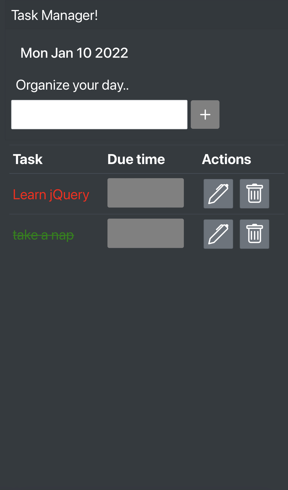

# Task manager

This project was built to learn and explore JQuery.  

Check the app: [Task manager](https://reem-alrashed.github.io/task-manager/)

## App functions
1. Add, edit, delete task.
2. Mark task as done.
3. Specify due time.

## Screen shots

### Laptop screenshot

### Mobile screenshot

